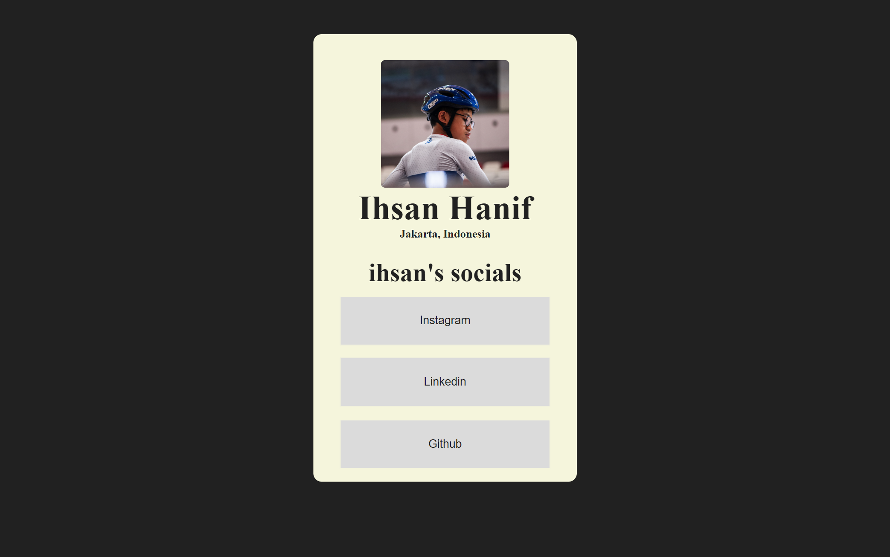

# Frontend Mentor - Social links profile solution
a readme template for my version of social links

This is a solution to the [Social links profile challenge on Frontend Mentor](https://www.frontendmentor.io/challenges/social-links-profile-UG32l9m6dQ). 

## Table of contents

- [Overview](#overview)
  - [The challenge](#the-challenge)
  - [Screenshot](#screenshot)
  - [Links](#links)
- [My process](#my-process)
  - [Built with](#built-with)
  - [What I learned](#what-i-learned)
  - [Continued development](#continued-development)
  - [Useful resources](#useful-resources)
- [Author](#author)
- [Acknowledgments](#acknowledgments)

**Note: Delete this note and update the table of contents based on what sections you keep.**

## Overview

### The challenge

**Users should be able to**:

- Interact with the buttons

### Screenshot




### Links

- Solution URL: [Add solution URL here](https://your-solution-url.com)
- Live Site URL: [Add live site URL here](https://your-live-site-url.com)

## My process

### Built with

- HTML5
- CSS
- Flexbox


### What I learned

```html

Use this section to recap over some of your major learnings while working through this project. Writing these out and providing code samples of areas you want to highlight is a great way to reinforce your own knowledge.

To see how you can add code snippets, see below:

```html
<h1>Some HTML code i learned more<h1>
<p>
  -button : learn about simplyfying link with just pressing butttons
  -class : a little bit of class
  not much on the html tbh
</p>
```
```css
.proud-of-this-css {
  colors
  using display flex
  all the flexbox command i use
  .btn
  and much more
}
```

### Continued development

will learn more about css especially at flexbox, also will learn js to add more feature on upcoming websites.
### Useful resources

- [Free Code Camp](https://www.freecodecamp.org) - I learn the basic html and css here, helped me alot

- [Frontend Mentor](https://www.frontendmentor.io) - This is where i got my idea about this project

## Author

- Instagram - [Ihsanhnf_](https://www.instagram.com/ihsanhnf_/)
- github - [Ihsanhanif](https://github.com/Ihsanhanif)

## Acknowledgments

a thank you for my uncle who introduced me to coding and helped me alot since. @hafizanadli [https://github.com/hafizanadli]